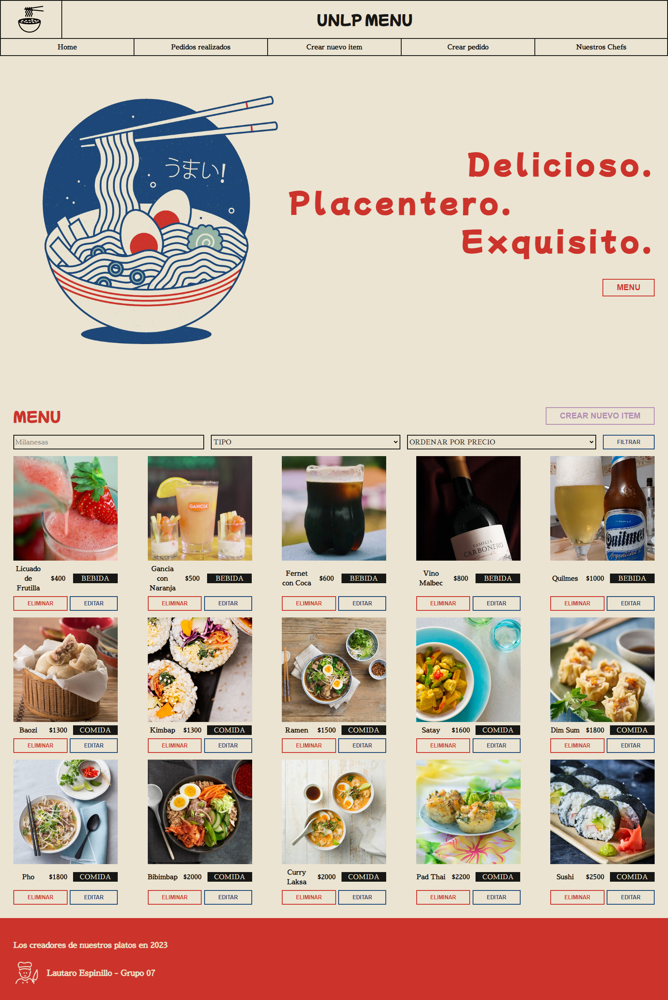
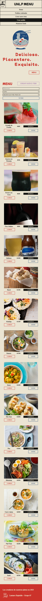

# MENU UNLP - TERCERA ENTREGA

La aplicacion final simula ser un menu de un restaurante con la que podemos CREAR, EDITAR, LEER O ELIMINAR distintos platos de la carta. Tambien tenemos la posibilidad de manejar una lista de pedidos realizados con las mismas funciones.

## Tabla de Contenidos

- [Instalación](#Instalación)
- [Ejecución del Frontend](#Ejecución-del-frontend)
- [Configuración del Backend](#Configuración-del-backend)
- [Configuración de la Base de Datos](#Configuración-de-la-base-de-datos)
- [Uso](#Uso)
- [Dependencias](#Dependencias)
- [Capturas de Pantalla](#capturas-de-pantalla)

## Instalación

1. Clona este repositorio que pertene al front-end: `git clone https://github.com/TheLaucha/MENU_UNLP_FRONT.git`
2. Accede al directorio del proyecto: `cd MENU_UNLP_FRONT`
3. Instala las dependencias: `npm install`

## Ejecución del Frontend

Para iniciar la aplicación frontend:

```bash
npm start
```

## Configuracion del back-end

1. Clona el siguiente repositorio que pertene al back-end: `git clone https://github.com/TheLaucha/MENU_UNLP_BACK.git`
2. Accede al directorio del proyecto: `cd MENU_UNLP_BACK`
3. Instala las dependencias: `npm install`
4. Inicia el servidor del backend: `php -S localhost:8080`

## Configuracion de la base de datos

1. Instala y configura tu servidor MySQL.
2. Crea una nueva base de datos.
3. Configura las credenciales de la base de datos en el backend.

## Uso

En el repositorio back-end se encuentra a disposicion un archivo llamado `SLIM_API_REST.postman_collection.json` el cual contiene todos los endpoints con ejemplos para realizar las comunicaciones con la API.

## Dependencias

### Front-end

1. react
2. react-router-dom
3. react-router-hash-link

### Back-end

1. slim
2. slim/psr7

## Capturas de pantalla



